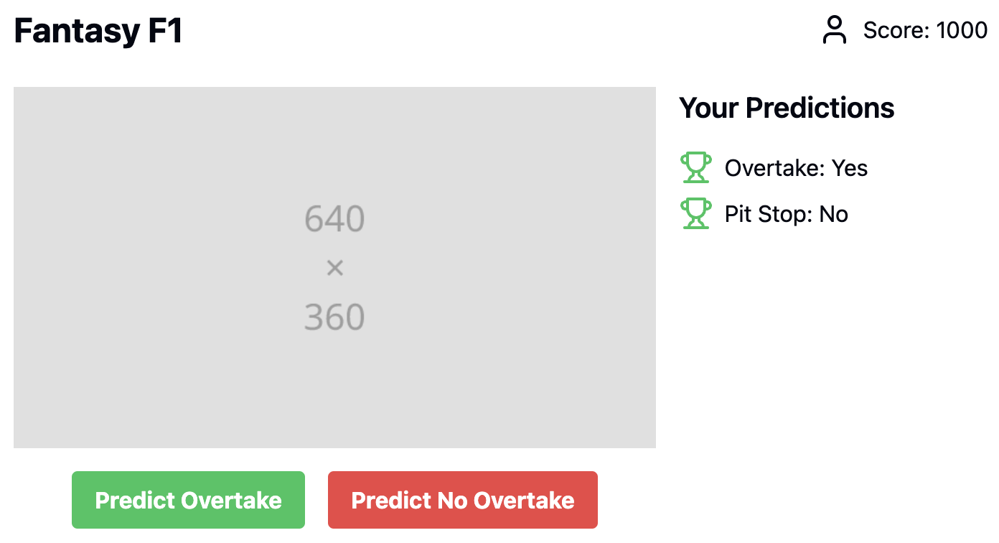

# Fantasy Formula - Web 3

This is an open source project created for the Hackathon at Harvard hosted by Easy A from July 27-28. 

# Summary

Fantasy sports have a track record of doing well in terms of monetization. With a large organic growth rate, the product markets itself.

This is a place where people can compete in their knowledge of Formula one. Everytime the gap closes between two cars, predict if there will be an overtake. Based on your overall performance, you will get assigned NFTs. Trade these for event passes, etc. Also get a ranking, on the leaderboard (will be implemented in the next few weeks hopefully)

Drive to survive already proved that the world is interested in who the drivers are as people, this draws on that very factor, which is why fantasy sports are so lucrative. Outside of that, people also like to show off a little bit.

# NFTs are have tangible value:

Based on the odds of a given overtake, you will get certain achievements. The rarer the achievement, the rarer the prediction, the higher the value. Trade achievements for event passes. (Potential idea) Based on the rank of the participants (based on sum of achievement values), top n candidates them can be invited, and meet their favorite driver. Hence it acts like an event pass. 

In short, it gives enthusiasts of Formula one exactly what they like the most - more from their formula one viewing experience.

Eventually this idea can be expanded on (creating content out of the top participants), etc. I would bet that it would create interesting content if the best predictors were in the same room, trying to throw each other off, etc.

# Technical description: 

It uses Unique Network to setup NFTs (mostly Native NFTs) for the project. Some of these will be made dynamic going forward (say the FIA changes their decision or applies a post race penalty). 

# Tasklist:

Done: 

- Proper Unique Network Integration
- Server side Code (for the most part)

Does not work:

- Client side code (specifically the alerts package for React + Next)

